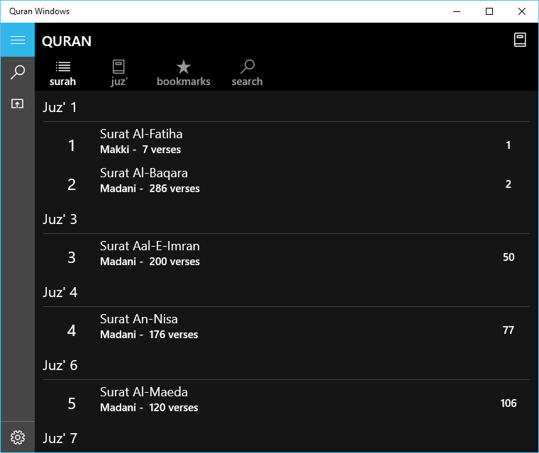
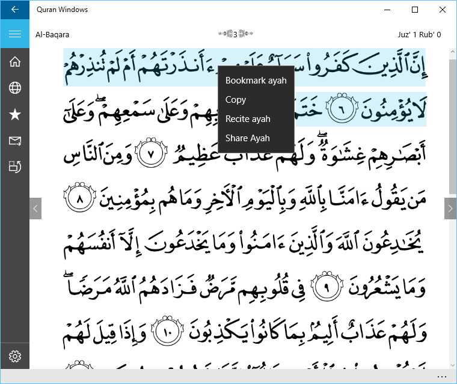
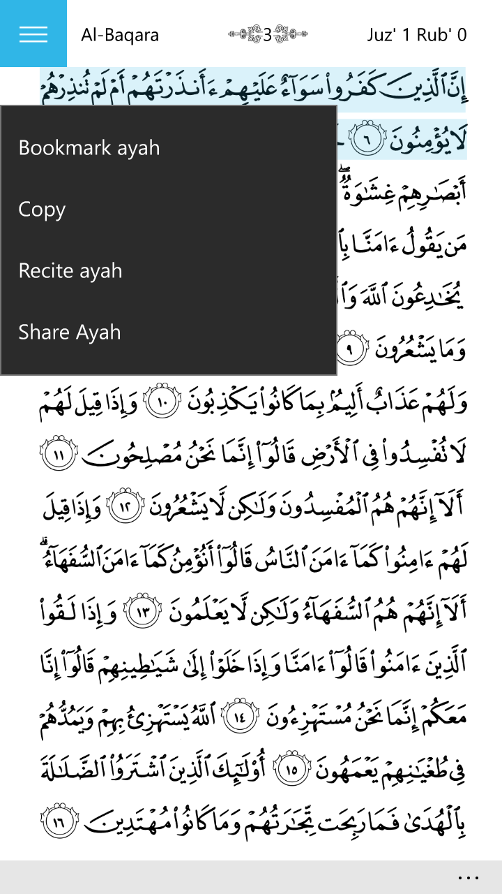

Quran Windows (formerly Quran Phone)
===========

**You can download the latest release of Windows Phone 7 and Windows Phone 8 versions from the store by searching for "Quran Phone"**

http://www.windowsphone.com/en-us/store/app/quran-phone/ca503de6-7cef-4ed3-8060-297578729314

**You can download the Windows 10 version of the app that supports both Windows 10 and Windows 10 Mobile from the store by searching for "Quran Windows"**

https://www.microsoft.com/store/apps/9nblggh5kqhl

Quran Windows is a free, open source Quran application for Windows (Windows Phone 7, Windows Phone 8, Windows 10, and Windows 10 Mobile) based on Quran Android project (http://android.quran.com/). There are many features still under development. Please send me your feedback and feature requests and keep all the contributors to this project in your prayers!

Quran Windows provides the following features in the current version:

  * crystal clear Madani compliant images.
  * beautiful and smooth page transition effect.
  * landscape mode for even larger fonts and more comfortable image viewing.
  * bookmarking of an unlimited number of pages (tap the screen to find the bookmark button).
  * audio recitations with highlighting support
  * ayah bookmarking, tagging, and sharing
  * search Arabic as well as your favorite translation
  * translations in many different languages (currently, Arabic Tafseer, English Sahih International Translation, French, German, Indonesian, Malay, Spanish, Turkish, Transliteration, Bosnian, Russian, Bengali, Kurdish, Somali, Dutch, Swahili, Malayalam, Azerbaijani, Tamil, and Urdu) with more coming soon.

Because Quran Windows is an open source project, it makes it easy for anyone to [contribute](https://github.com/stankovski/quran-phone/pulls) and help improve the project. We are also open to hearing your [suggestions](https://github.com/stankovski/quran-phone/issues) to make Quran Windows the best Quran application on the market.

_Main screen_

_Crystal clear Madani compliant images_

_Support for Windows 10 Mobile_

_Support for Windows Phone 7 and 8_

# Setup

1.  Make sure that you have VS with [Windows Phone 10 SDK](https://dev.windows.com/en-us/downloads) installed at least.
2.  Make sure that sqllite extension is installed right and that the installed version matches the ones used in the project 
[You can install it from here](https://visualstudiogallery.msdn.microsoft.com/5d97faf6-39e3-4048-a0bc-adde2af75d1b)
3.  Build the project and try to fix any damaged references by re-referencing them.
4.  Set Quran.Windows project as Startup Project

